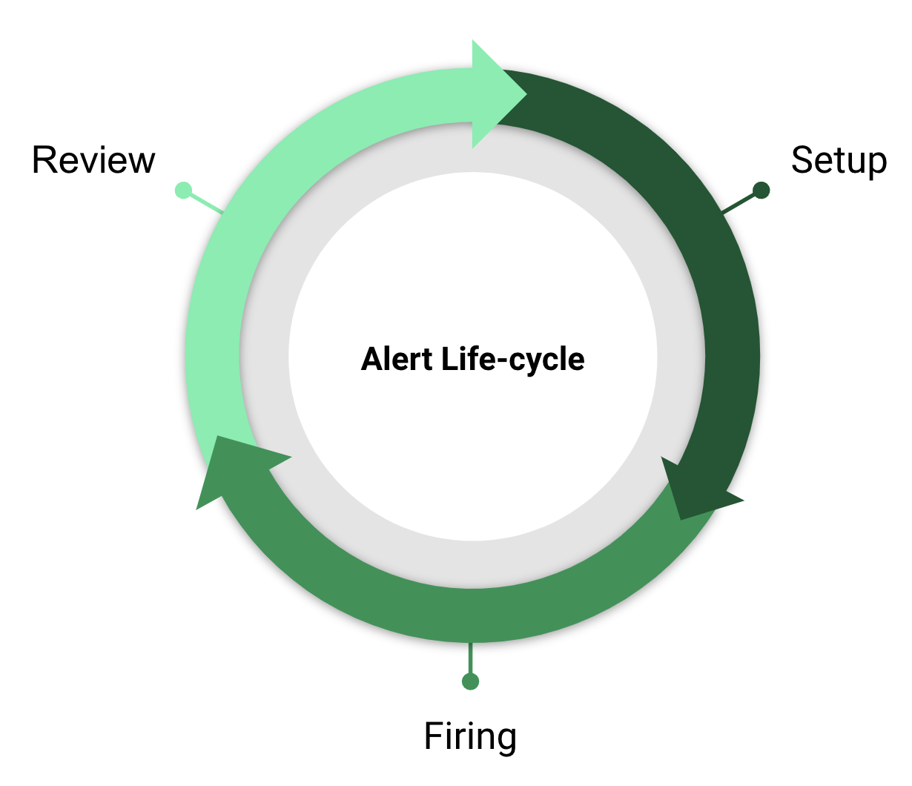
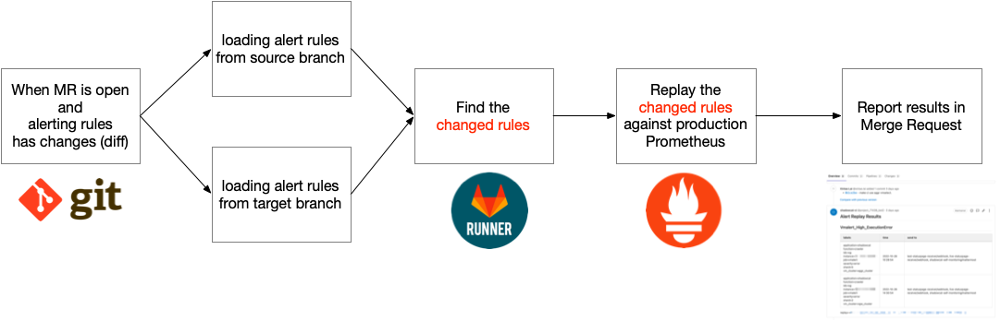

<!-- _class: lead -->

# Alerting with Confidence

laixintao
Twitter: [@laixintao](https://twitter.com/laixintao)
Github: [laixintao](https://github.com/laixintao)

---

## Agenda

1. Setup Alert Rules with Confidence
2. Fire Alerts with Confidence
3. Review Alerts with Confidence



---

## Setup Alert Rules with Confidence <!--fit-->

---


### Questions

We have **no confidence** in these questions:

- Did I use the syntax rules correctly?
- Is this threshold reasonable?
- How many times will my alerts be fired everyday?
- Who will receive alerts? Am I missing my labels for this alert?
- My alert rules are all set, but what if someone breaks them?

---

### CI is your friend!

(By the way, we use [GitOps](https://www.gitops.tech/))

##### Pros

- Git commit history (Revert/Rollback is easy)
- Review changes like you reviewing the code
- CI tests everything for you
- No magic under the hood, everything is the code in the repository
- You can use your favorite editor to edit everything! (I mean Vim, of course 😎)

##### Cons

- Not user friendly as web UI (well, GitOps is also user friendly, it's just very picky about who its friends)


---

<!-- _class: question -->

#### Did I use the syntax rules correctly?

### Test the syntax of alerting rules

[`promtool`](https://github.com/prometheus/prometheus/tree/main/cmd/promtool)

```shell
$ promtool check rules node_alert.yaml
Checking node_alert.yaml
  SUCCESS: 4 rules found

```

Failed example:

```shell
$ promtool check rules node_alert.yaml
Checking node_alert.yaml
  FAILED:
node_alert.yaml: 0:0: group "node-general", rule 1, "": one of 'record' or 'alert' must be set
```

---

### Test syntax of alertmanager config


---
<!-- _class: question -->

#### Is this threshold reasonable? How many times will my alerts be fired everyday?

### Replay your alert rules against real metrics data



---

#### Replay (Backfilling)

1. Read the history data from one place
2. Evaluate the recording rules or alert rules
3. Save the results as new metrics

#### Tools

1. [Promutil.py by ScyllaDB](https://github.com/scylladb/scylla-monitoring/blob/master/promutil.py) ([doc](https://scylladb.medium.com/prometheus-backfilling-recording-rules-and-alerts-1ca31ce12e59)): only ~200 lines of code
2. [Vmalert rules Backfilling](https://docs.victoriametrics.com/vmalert.html#rules-backfilling)


---


Including:
- Firing times
- Labels with alerts
- Where will the alert be sent to

---

<!-- _class: question -->

#### Who will receive alerts? Am I missing my labels for this alert?

### Amtool route test

```shell
$ amtool --alertmanager.url https://127.0.0.1:9093 config routes test application=node
infra-channel/slack,infra-on-call/sms
```

---

<!-- _class: question -->
#### My alert rules are all set, but what if someone breaks them?

### Unit test for important alerts!

[Prometheus unit testing](https://prometheus.io/docs/prometheus/latest/configuration/unit_testing_rules/)

```shell
$ promtool test rules test.yaml
Unit Testing:  test.yaml
  SUCCESS

```

---

### Nice! Everything merged to main branch is correct now!

1. Testing everything we can when a new change is made
2. Review by peers
3. Merge!
4. CD: Automatic deployment

---

## Fire Alerts with Confidence <!--fit-->

---

## Review Alerts with Confidence <!--fit-->

---

# Thank you! <!--fit-->
